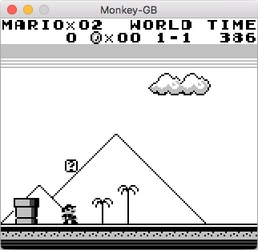
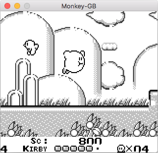
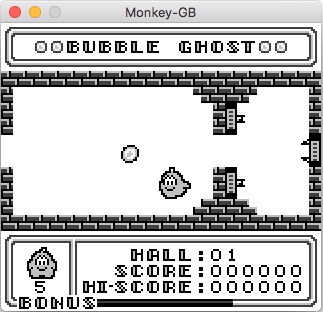

<p>
  <h1>Monkey GB</h1>
  <p>
    Game Boy emulator completely written in Kotlin
  </p>
</p>


## About The Project



<br/>

### Installation

If you want ot skip the build process, go to the <a href="https://github.com/andrea321123/Monkey-GB/releases">release</a> page.
Here are the steps to build the emulator from sources:

1. Clone the repo
```sh
git clone https://github.com/andrea321123/Monkey-GB
```
2. Compile with Maven
```sh
mvn clean compile
mvn package
```

Jar file should be found in target directory. <br>

## Usage

After putting a .gb ROM file in the same directory of the Jar file, run
```sh
java -jar jarfile.jar romName.gb
```
where [jarfile.jar] is the name of the emulator jar file.<br><br>


<br/>

## Issues
The emulator has issues running some games; furthermore, MBC3 memory banking and sound aren't implemented yet
