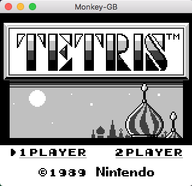
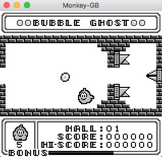

<!--
*** Thanks for checking out this README Template. If you have a suggestion that would
*** make this better, please fork the repo and create a pull request or simply open
*** an issue with the tag "enhancement".
*** Thanks again! Now go create something AMAZING! :D
***
***
***
*** To avoid retyping too much info. Do a search and replace for the following:
*** github_username, repo, twitter_handle, email
-->


<!-- PROJECT SHIELDS -->
<!--
*** I'm using markdown "reference style" links for readability.
*** Reference links are enclosed in brackets [ ] instead of parentheses ( ).
*** See the bottom of this document for the declaration of the reference variables
*** for contributors-url, forks-url, etc. This is an optional, concise syntax you may use.
*** https://www.markdownguide.org/basic-syntax/#reference-style-links
-->

<!-- PROJECT LOGO -->
<br />
<p>

  <h2>Monkey GB</h3>

  <p>
    Game Boy emulator completely written in Kotlin
  </p>
</p>


<!-- ABOUT THE PROJECT -->
## About The Project


<br/>

<br/>



### Installation
 
1. Clone the repo
```sh
git clone https://github.com/andrea321123/Monkey-GB
```
2. Compile with Maven
```sh
mvn clean compile
mvn package
```

Jar file should be found in target directory

<!-- USAGE EXAMPLES -->
## Usage

After putting a .gb ROM file i the same directory of the Jar file, run
```sh
java -jar Monkey-GB-1.0-jar-with-dependencies.jar romName.gb
```

<br/>

The emulator has issues running some games; furthermore, MBC3 memory banking and sound aren't implemented yet
